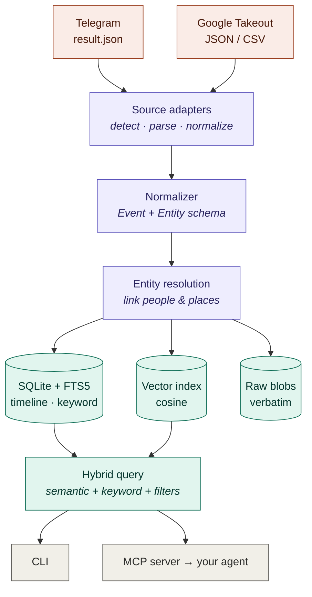
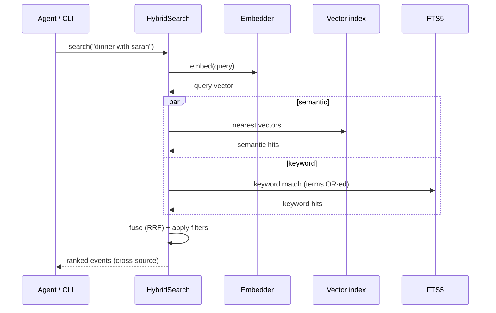

# Backstory

> Your data exports, finally searchable — and entirely on your machine.

Point Backstory at your **Google Takeout** and **Telegram** exports and it builds one local,
searchable timeline of your own life. Query it in natural language from the CLI, or wire it into any
agent over **MCP**. No cloud, no accounts, no API calls.

This is the most personal data you own, so local-first isn't a feature here — it's the whole point.

## Why

Every service offers "download your data," but what comes back is an unbrowsable pile of JSON/CSV.
[Dogsheep](https://dogsheep.github.io/) is the closest prior art, but it's fragmented per-service
CLIs with no semantic search and no cross-source joins. Backstory unifies the exports, adds hybrid
semantic + keyword search, resolves people and places across sources, and exposes it all to agents.

## Benchmark

Run `backstory eval` (or `dotnet run --project eval/Backstory.Eval`) to reproduce:

| Embedder | Ingestion coverage | Recall@5 |
|---|---|---|
| Hashing (default, offline, zero setup) | **100%** | **87.5%** |
| ONNX MiniLM (after `backstory model fetch`) | **100%** | **100%** |

The semantic model resolves paraphrases the lexical embedder can't — e.g. *"japan vacation"* finds
*"flight to Tokyo"* with no shared words.

## Install / build

Requires the **.NET 10 SDK**.

```bash
dotnet build Backstory.slnx
dotnet test  Backstory.slnx
```

## Usage

```bash
# Import an export (adapter auto-detected)
backstory import ~/Downloads/telegram-export/result.json
backstory import ~/Downloads/Takeout

# Search your timeline
backstory search "dinner plans with sarah"
backstory search "trip to japan" --from 2023-01-01 --source telegram

# Browse and inspect
backstory timeline --limit 20
backstory entity "Sarah K"
backstory stats

# Upgrade to semantic embeddings (one-time, opt-in ~90 MB download)
backstory model fetch
# then re-import your exports to re-embed them with the semantic model

# Run the benchmark
backstory eval
```

The vault lives at `$BACKSTORY_DB` or `~/.backstory/backstory.db`.

## Use it from an agent (MCP)

```bash
backstory serve   # speaks MCP over stdio
```

Register it with an MCP client (e.g. Claude Desktop / Claude Code):

```json
{
  "mcpServers": {
    "backstory": { "command": "backstory", "args": ["serve"] }
  }
}
```

Tools exposed: `search_timeline`, `get_events`, `lookup_entity`, `summarize_period`, `list_sources`.

## How it works

The mess of each export format is quarantined inside a per-source **adapter**; everything downstream
works on one normalized `Event` / `Entity` model. Storage is SQLite (timeline + FTS5 keyword search)
plus a brute-force cosine vector index. Search fuses semantic and keyword hits via Reciprocal Rank
Fusion. See [SPEC.md](SPEC.md) for the full design.



A single search fuses the semantic and keyword retrievers — no score calibration needed, since
Reciprocal Rank Fusion ranks by position:



## Supported sources (v1)

- **Google Takeout** — Search history, YouTube history, Maps saved places, Semantic Location History
- **Telegram** — messages, contacts (Telegram Desktop JSON export)

Adding a source means implementing one `ISourceAdapter`. Instagram, Spotify, WhatsApp and more are on
the roadmap.

## Embeddings

Backstory ships two embedders behind one `IEmbeddingService` interface (both 384-dim, so they're
interchangeable):

- **Hashing** (default) — dependency-free, fully offline, deterministic, zero model assets. Lexical:
  it matches shared words/characters. Everything works out of the box with this.
- **ONNX MiniLM** (`all-MiniLM-L6-v2`) — true semantic embeddings run locally via ONNX Runtime. Run
  `backstory model fetch` once (~90 MB) and it's selected automatically. Matches *meaning*, not just
  words, which is what lifts Recall@5 to 100% on the benchmark.

Switching is just fetching the model; for a multilingual corpus, drop in a multilingual MiniLM — same
code.

## Privacy

100% local. No telemetry. The only network access ever contemplated is an optional, opt-in, one-time
embedding-model download for the ONNX upgrade — never your data.
