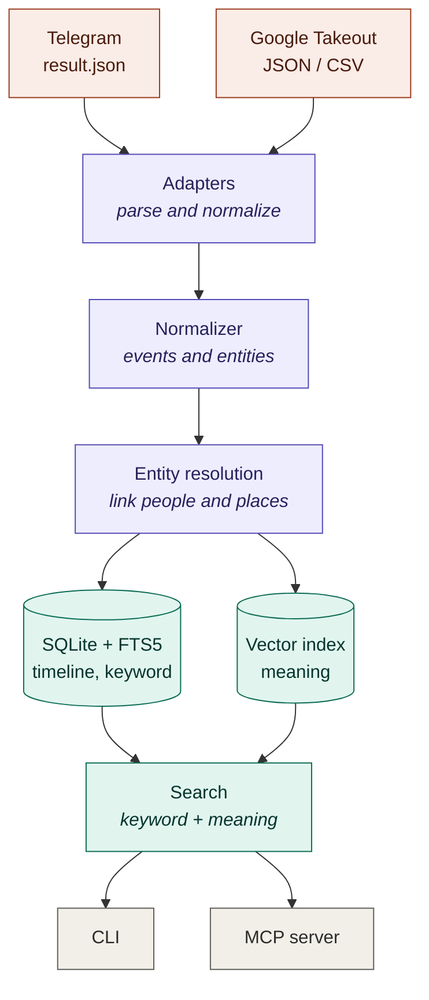

# Backstory

Search your own data exports from one place, on your own machine.

[](https://github.com/magna-nz/backstory/actions/workflows/ci.yml)
[](https://dotnet.microsoft.com/)
[](https://modelcontextprotocol.io/)
[](#quick-start)
[](LICENSE)
[](https://magna-nz.github.io/backstory/)

You can download your data from Google, Telegram, and most other services. The problem is what you get back: a pile of JSON and CSV files that are nearly impossible to read. Backstory pulls those exports into one local database and lets you search across all of them at once. You can search from the command line or connect it to an AI assistant over MCP.

Nothing is sent to the cloud. Your data stays in a SQLite file on your machine. That is the main reason this tool exists, since this is the most personal data you have.

## What it can do

- Import Google Takeout and Telegram exports (more sources later).
- Search everything as one timeline, by meaning or by keyword.
- Match the same person or place across different sources.
- Answer questions from an AI agent, like "when did I last message Sarah about dinner?".
- Show you how to export your data, then import it automatically when it finishes downloading.
- Report a benchmark so you can see how well the search actually works.

## Quick start

You need the .NET 10 SDK. It runs on Linux, macOS, and Windows.

Install as a global tool (once the first release is published):

```bash
dotnet tool install -g Backstory --prerelease
```

Or build from source today:

```bash
git clone https://github.com/magna-nz/backstory && cd backstory
dotnet build Backstory.slnx -c Release
```

Get your data in. Backstory shows you how to export it, then imports it for you when it lands in your Downloads folder:

```bash
backstory fetch google      # or: telegram
backstory watch
```

You can also point it at a file or zip yourself. Takeout zips are unpacked for you, including the multi-part ones:

```bash
backstory import ~/Downloads/takeout-20240101.zip
backstory import ~/Downloads/telegram-export/result.json
```

Then search:

```bash
backstory search "dinner plans with sarah"
backstory search "trip to japan" --from 2023-01-01
```

## Use it from an AI agent

Backstory speaks MCP, so any MCP client (Claude and others) can query your timeline. Start the server:

```bash
backstory serve
```

Register it with one command:

```bash
claude mcp add backstory -- backstory serve
```

Or add it to your MCP config directly:

```json
{
  "mcpServers": {
    "backstory": { "command": "backstory", "args": ["serve"] }
  }
}
```

Now you can ask the agent things like "what was that ramen place I looked up in Tokyo?" and it searches across both your Google and Telegram data to answer.

## How it works

Every export format is messy in its own way, so a small adapter handles each one and converts it into the same shape: events on a timeline, plus the people and places they mention. From there everything works the same. Storage is SQLite with a full-text index for keywords and a vector index for meaning. A search runs both and combines the results.



There is a full technical writeup at [magna-nz.github.io/backstory](https://magna-nz.github.io/backstory/) and in [SPEC.md](SPEC.md).

## Commands

| Command | What it does |
|---|---|
| `fetch google\|telegram` | Show how to export your data, and open the page |
| `watch [--dir <path>]` | Import exports automatically as they download to `~/Downloads` |
| `import <path>` | Import an export (file, folder, or Takeout zip) |
| `search "<query>"` | Search the timeline. Filters: `--from --to --source --limit` |
| `timeline` | List events in time order, with the same filters |
| `entity "<name>"` | Look up a person or place |
| `stats` | Counts by source and type, and the embedder in use |
| `serve` | Run the MCP server |
| `model fetch` | Download the semantic search model (optional, one time) |
| `eval` | Run the benchmark |

The database lives at `$BACKSTORY_DB`, or `~/.backstory/backstory.db` by default.

## Search quality

There are two ways to turn text into vectors, and you can switch between them:

- Hashing (default). No setup, fully offline, matches on the words that appear. Good enough to get started.
- ONNX MiniLM. Real semantic search that matches on meaning. Run `backstory model fetch` once (about 90 MB) and Backstory uses it automatically. This is what lets a search for "japan vacation" find a message about a "flight to Tokyo".

You can measure the difference yourself with `backstory eval`. It loads sample data and reports two numbers: how much of the data was parsed, and how often the right event shows up in the top five search results.

| Embedder | Data parsed | Right answer in top 5 |
|---|---|---|
| Hashing (default) | 100% | 87.5% |
| ONNX MiniLM | 100% | 100% |

## Sources

Today: Google Takeout (search history, YouTube history, saved places, location history) and Telegram (messages and contacts). Adding a source means writing one adapter. Nothing else changes.

## MCP tools

| Tool | What it returns |
|---|---|
| `search_timeline` | Ranked events for a natural-language query |
| `get_events` | Full event records by id, including a pointer to the source |
| `lookup_entity` | A person or place by name |
| `summarize_period` | Every event in a date range, for the agent to summarize |
| `list_sources` | The sources imported and how many events each has |

## Privacy

Everything runs locally and there is no telemetry. The only time Backstory touches the network is when you run `backstory model fetch` to download the search model, and that step is optional. Your data never leaves your machine. The `.gitignore` is set up so a database or an export can't be committed by accident.

## License

MIT. See [LICENSE](LICENSE). Built on the [ModelContextProtocol SDK](https://github.com/modelcontextprotocol/csharp-sdk), [ONNX Runtime](https://github.com/microsoft/onnxruntime), and [all-MiniLM-L6-v2](https://huggingface.co/sentence-transformers/all-MiniLM-L6-v2).
