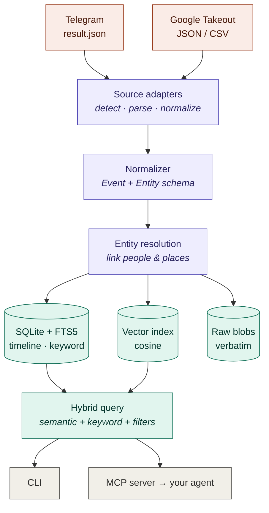

# Backstory

### Your data exports, finally searchable — and entirely on **your** machine.

[](https://github.com/magna-nz/backstory/actions/workflows/ci.yml)
[](https://dotnet.microsoft.com/)
[](https://modelcontextprotocol.io/)
[](#use-it-in-3-steps)
[](#benchmark)
[](LICENSE)
[](https://magna-nz.github.io/backstory/)

> **MIT-licensed, local-first explorer that turns your data exports into one searchable timeline of
> your life — queryable from a CLI or any AI agent over [MCP](https://modelcontextprotocol.io/).**
>
> ✅ **Google Takeout** &nbsp;·&nbsp; ✅ **Telegram** &nbsp;·&nbsp; ✅ **semantic + keyword search** &nbsp;·&nbsp; ✅ **zero cloud, zero API calls**
>
> Your most personal data never leaves your machine — local-first isn't a feature here, it's the point.

Every service offers "download your data," but it comes back as an unbrowsable pile of JSON/CSV.
Backstory ingests those exports through per-source adapters into one normalized timeline, indexes it
for hybrid semantic + keyword search, resolves people and places across sources, and exposes it all to
agents over MCP. Instead of grepping a 5&nbsp;GB Takeout folder, you just *ask*.

Two adapters today (Google Takeout, Telegram), a unified `Event`/`Entity` model, an offline default
embedder plus an opt-in semantic one, and a benchmark that hits **100% ingestion coverage / 100%
Recall@5**.

## See it in action

### When did I last make plans with someone?

**You**

> When did I last talk to Sarah about dinner plans?

**Claude** *(via the `search_timeline` MCP tool)*

> On **14 March** you and Sarah agreed to get dinner at **Dishoom** on Friday. It came up again two
> days later when she asked if you'd booked it. Want the surrounding messages?

### Find something across every source at once

**You**

> I looked up a ramen place in Tokyo a while back — Telegram or a Google search, I forget. What was it?

**Claude**

> Found it across both: you **searched Google** for *"best ramen in shibuya"* on 10 March, and
> mentioned it in **Telegram** the same week. Same place — Backstory linked them by topic and location.

### …or just use the CLI

```bash
backstory search "trip to japan" --from 2023-01-01
# 2023-04-02  [telegram/telegram_message]  (semantic)  booked the flight to Tokyo for may
```

## How it works

The mess of each export format is quarantined inside a per-source **adapter**; everything downstream
works on one normalized `Event` / `Entity` model. Storage is SQLite (timeline + FTS5 keyword search)
plus a brute-force cosine vector index. Search fuses semantic and keyword hits via Reciprocal Rank
Fusion. Full design in [SPEC.md](SPEC.md); browsable docs at
[magna-nz.github.io/backstory](https://magna-nz.github.io/backstory/).



## Use it in 3 steps

Requires the [.NET 10 SDK](https://dotnet.microsoft.com/download). Runs on **Linux**, **macOS**, and
**Windows** — it's pure .NET.

1. **Install it** as a .NET global tool:
   ```bash
   dotnet tool install -g Backstory --prerelease
   ```
   …or build from source:
   ```bash
   git clone https://github.com/magna-nz/backstory && cd backstory
   dotnet build Backstory.slnx -c Release
   ```
2. **Import an export** (adapter auto-detected).
   ```bash
   backstory import ~/Downloads/telegram-export/result.json
   backstory import ~/Downloads/Takeout
   ```
3. **Search it, or wire it into an agent.**
   ```bash
   backstory search "dinner plans with sarah"
   backstory serve        # MCP server over stdio
   ```

The vault lives at `$BACKSTORY_DB` or `~/.backstory/backstory.db`.

### Register the MCP server

```bash
claude mcp add backstory -- backstory serve
```

…or edit your MCP client config directly:

```json
{
  "mcpServers": {
    "backstory": { "command": "backstory", "args": ["serve"] }
  }
}
```

## CLI

| Command | Does |
|---|---|
| `import <path>` | Auto-detect adapter and ingest an export |
| `search "<query>"` | Hybrid search; `--from --to --source --limit` |
| `timeline` | Chronological events with filters |
| `entity "<name>"` | Look up a person or place |
| `stats` | Counts by source/type, active embedder |
| `serve` | Run the MCP server (stdio) |
| `model fetch` | Download the semantic model (one-time, opt-in) |
| `eval` | Run the benchmark |

## MCP tools

| Tool | Purpose |
|---|---|
| `search_timeline` | Natural-language search over your timeline |
| `get_events` | Full event records by id (incl. source pointer) |
| `lookup_entity` | Resolve a person/place by name |
| `summarize_period` | All events in a range for the agent to summarize |
| `list_sources` | Sources ingested and their event counts |

## Embeddings

Two embedders behind one `IEmbeddingService` (both 384-dim, interchangeable):

- **Hashing** (default) — dependency-free, fully offline, deterministic, zero model assets. Lexical.
  Everything works out of the box with this.
- **ONNX MiniLM** (`all-MiniLM-L6-v2`) — true semantic embeddings run locally via ONNX Runtime. Run
  `backstory model fetch` once (~90&nbsp;MB) and it's selected automatically. It's the difference
  between *"japan vacation"* finding nothing and finding *"flight to Tokyo"*.

## Benchmark

Reproducible with `backstory eval` — ingests bundled fixtures and measures coverage (emitted vs.
present, surfacing silent loss) and Recall@5 over a hand-built question→gold set.

| Embedder | Ingestion coverage | Recall@5 |
|---|---|---|
| Hashing (default, offline, zero setup) | **100%** | **87.5%** |
| ONNX MiniLM (after `backstory model fetch`) | **100%** | **100%** |

## How this compares

| Project | Local-first | Cross-source | Semantic search | Agent (MCP) | Benchmark |
|---|---|---|---|---|---|
| **Backstory** *(this)* | ✅ | ✅ unified timeline | ✅ | ✅ | ✅ coverage + R@5 |
| [Dogsheep](https://dogsheep.github.io/) | ✅ | ❌ per-service silos | ❌ | ❌ | ❌ |
| Single-service export viewers | ✅ | ❌ | usually ❌ | ❌ | ❌ |

Backstory's edge is the **unified cross-source timeline + semantic search + MCP** — the thing Dogsheep
can't do, and the thing an agent can't do ad-hoc against raw export files.

## Docs

- **[Technical docs site](https://magna-nz.github.io/backstory/)** — architecture, internals, every component
- **[SPEC.md](SPEC.md)** — full design, scope, and decisions
- **[STATUS.md](STATUS.md)** — current state and what's next

## Privacy

100% local, no telemetry. The only network access in the entire project is the opt-in, one-time
embedding-model download via `model fetch` — never your data. `.gitignore` keeps vault databases,
models, and exports out of source control.

## License

MIT — see [LICENSE](LICENSE). Built on the
[ModelContextProtocol SDK](https://github.com/modelcontextprotocol/csharp-sdk) (MIT),
[ONNX Runtime](https://github.com/microsoft/onnxruntime) (MIT), and
[all-MiniLM-L6-v2](https://huggingface.co/sentence-transformers/all-MiniLM-L6-v2) (Apache-2.0).
